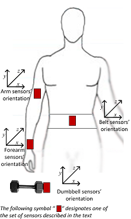
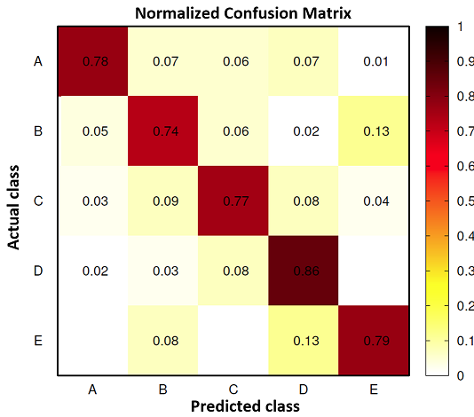

## Introduction

Using devices such as Jawbone Up, Nike FuelBand, and Fitbit it is now possible to collect a large amount of data about personal activity relatively inexpensively. These type of devices are part of the quantified self movement - a group of enthusiasts who take measurements about themselves regularly to improve their health, to find patterns in their behavior, or because they are tech geeks. One thing that people regularly do is quantify how much of a particular activity they do, but they rarely quantify how well they do it. 

In this project, I will use data from accelerometers on the belt, forearm, arm, and dumbell as illustrated in the image below from 6 participants.



*source: [Weight Lifting Exercises Dataset](http://groupware.les.inf.puc-rio.br/har#weight_lifting_exercises)*


They were asked to perform barbell lifts correctly and incorrectly in 5 different ways:

  * Class A: exactly according to the specification
  * Class B: throwing the elbows to the front
  * Class C: lifting the dumbbell only halfway
  * Class D: lowering the dumbbell only halfway
  * Class E: throwing the hips to the front

Class A corresponds to the specified execution of the exercise, while the other 4 classes correspond to common mistakes. I will design a model to use the collected data from these accelerometers to predict which class a participant was performing.


## Data Source and Data Preparation

The data for this project come from this source: http://groupware.les.inf.puc-rio.br/har. Before starting to fit a model, data preparation is performed.

I created a data folder under this working directory. and downloaded the dataset into this folder. A few simple data explorative exercises are performed.

```{r,eval=FALSE}
traindata <- read.csv("data/pml-training.csv")
str(traindata)
```

From the data exploration, we learned that there are 19622 observations and 160 variables. However, we have noticed that there are some data are "NA", blank or "#DIV/0!". Since we don't have too much information how to manage these values, we will treat them all as not available data and therefore we will reimport the data with na.strings parameter. Also, the first few of variables: x, user_name, raw_timestamp_part_1, raw_timestamp_part_2, cvtd_timestamp, new_window, and Num_window, they are seems not very useful to the analysis and I decided to leave them out.

```{r,eval=FALSE}
traindata <- read.csv("data/pml-training.csv",na.strings = c("NA", "", "#DIV/0!"))
traindata <- traindata[,-c(1:7)]
str(traindata)
```

Now, since here we don't really want to deal with missing data variables. We would like to fit our model only with those variables without any missing data.

```{r}
traindata <- read.csv("data/pml-training.csv",na.strings = c("NA", "", "#DIV/0!"))
traindata <- traindata[,-c(1:7)]
myNAColTrain <- function(i) {sum(is.na(traindata[,i]) * 1) } # create a function to find any variable with missing data
usableColsTrain <- sapply(1:dim(traindata)[2],myNAColTrain) == 0 # get only variables with full observations
traindata <- traindata[,usableColsTrain]
str(traindata)
```

After this data cleaning process, we got 53 variables without any missing data which includes our classifier outcome: classe.

We also prepare same for our test dataset:


```{r}
testdata <- read.csv("data/pml-testing.csv",na.strings = c("NA", "", "#DIV/0!"))
testdata <- testdata[,-c(1:7)]
myNAColTest <- function(i) {sum(is.na(testdata[,i]) * 1) }
usableColsTest <- sapply(1:dim(testdata)[2],myNAColTest) == 0 # get only variables with full observations
testdata <- testdata[,usableColsTest]
```


## Constructing the Prediction Model

in order to compare the prediction accuracy. I will 2 different predictive Algorithms: Recursive Partitioning and Regression Trees (rpart) and random forest, and compare the accuracy of the outcome.

### Data Partition

in order to perform across validation, a data splitting process is performed by using createDataPartition functions. I will use the k-fold Cross Validation trainControl resampling method here and the default is 10 folds. (since it takes too long to process the random forest model with 10 folds, I set 5 folds here to reduce the process time which in my laptop takes 9 minutes.)

```{r,message=FALSE}
set.seed(130308)
library(caret);library(rattle)
inTrain <- createDataPartition(traindata$classe, p = 0.7, list = FALSE)
trainPart <- traindata[inTrain,]
validPart <- traindata[-inTrain,]
kfoldCV <- trainControl(method = "cv",number = 5) # use 5-fold cross validation change to smaller if run too long
```


### Use RPART Classification

```{r,message=FALSE}
modfit_rpart <- train(classe ~ ., data = trainPart, method = "rpart" , trControl = kfoldCV )
print(modfit_rpart)
```

```{r,echo=FALSE}
fancyRpartPlot(modfit_rpart$finalModel) # Plot the rpart outcome tree.
```

Now i will use the model trained to validate the data.

```{r,message=FALSE}
valid_rpart <- predict(modfit_rpart, newdata = validPart)
# get the confusionMatrix Results for rpart classification
(cmOutcome <-confusionMatrix(validPart$classe,valid_rpart))
```

Based on the outcome of the confusionMatrix, the rpart model accuracy rate is `r cmOutcome$overall[1]`. So the out-of-sample error rate for this classification model is `r 1 - cmOutcome$overall[1]`. This is far below my expectation, and I will look forward to a second prediction algorithm to perform prediction better.


### Use Random Forest

```{r,message=FALSE}
# ct <- proc.time() # get start time
modfit_rf <- train(classe ~ ., data = trainPart, method = "rf" , trControl = kfoldCV )
# proc.time() - ct # check the time elapsed for the rf model
# print(modfit_rpart)
valid_rf <- predict(modfit_rf, newdata = validPart)
# get the confusionMatrix Results for rpart classification
(cmOutcome <-confusionMatrix(validPart$classe,valid_rf))
```

Based on the outcome of the confusionMatrix, the random forest model accuracy rate is `r cmOutcome$overall[1]`. So the out-of-sample error rate for this model is `r 1 - cmOutcome$overall[1]`. 

This is a very impressive accuracy rate. In comparison to the Weight Lifting Exercises normalized confusion matrix chart online, you can tell that this confusion matrix outcome from random forest model is much better.



*source: [Weight Lifting Exercises Confusion Matrix](http://groupware.les.inf.puc-rio.br/har#weight_lifting_exercises)*

```{r,message=FALSE}
cmOutcome <- confusionMatrix(validPart$classe,valid_rf,dnn=c("RF Prediction","Actual Class"))
# transform the column and rows to make it comparable witht the chart above
t(as.matrix(round(cmOutcome$table / colSums(cmOutcome$table),2)))
```


### Predict Test Data

Since the model based on random forest results in a much better accuracy rate, I will use this model to predict the test dataset.

```{r,message=FALSE}
test_rf <- predict(modfit_rf, newdata = testdata)
test_rf
table(test_rf)
```


```{r,echo=FALSE}
# pml_write_files <- function(x){
#   n = length(x)
#   for(i in 1:n){
#     filename = paste0("problem_id_",i,".txt")
#     write.table(x[i],file=filename,quote=FALSE,row.names=FALSE,col.names=FALSE)
#   }
# }
# pml_write_files(test_rf)
```


